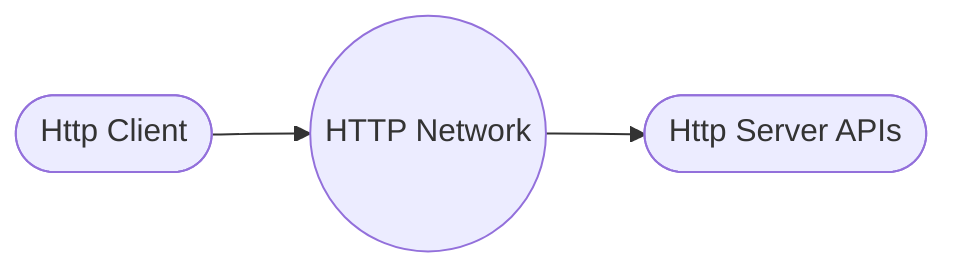

## HTTP services
HTTP is the defacto standard to access application/services these days, Hence all software is written to be accessed over HTTP protocol.

### Client Server Model
Now the http services can be consumed by http clients over APIs

Now there are different standards of API
- REST
- OpenAPI
- RPC
- GraphQL

## Definition
REST is Representational State Transfer which basically means exposing functionality based on entity/resource of the application.

REST APIs are defined using HTTP standard.

We will take an example of Employee Management System where employee is one of the resource/entity in our application.

## REST and HTTP

### __Endpoint__ 
Based on employee managemnet application, we can define one endpoint for e.g. `/api/employees` 

### __Operation Type__ 
HTTP Verbs are used for different operation types as listed below

|Operation|HTTP verb|
|---------|---------|
|Read     | HTTP GET Verb|
|Create   | HTTP POST verb|
|Delete   | HTTP DELETE verb|
|Update   | HTTP PUT/PATCH verb|

### __Return Status__ 
To provide whether the API call was successful or not we rely on _HTTP status_ codes

|Http Status Code Range|Meaning|
|---------|---------|
|200-299   | Success|
|300-399  | Redirection|
|400-499  | Client Error|
|500-  | Server Error|

### __Content Negotiation__ 
To provide information of the sent/expected data format of the payload we use below _HTTP headers_ 

|Http Header|Meaning|Examples|
|---------|---------|---------|
|Content-Type   | Request format sent to Server|text/plain, application/xml, text/html, application/json|
|Accept-Type  | Response format expected from Server|text/plain, application/xml, text/html, application/json|

### __Response Compression__ 
To provide information for respeonce compression REST use below _HTTP headers_

|Http Header|Meaning|Examples|
|---------|---------|---------|
|Content-Encoding   | Compression Method used byserver Server|gzip|
|Accept-Encoding  | Compresseion Methods Client understands|compress, gzip, br|