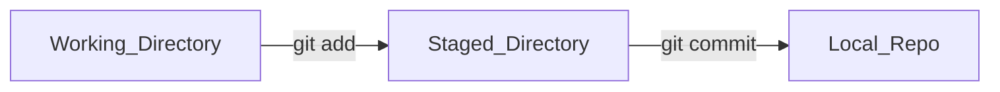

## What is Git
Git is a distributed version control system required in managing source code in big teams. It also helps to deliver the software to wider community.


sequenceDiagram
  participant A_Repo
  participant Github
  participant B_Repo
  Github->>A_Repo: clone/pull master
  Note right of A_Repo: local development cycle
  Github->>B_Repo: clone/pull master
  Note right of B_Repo: local development cycle


## Git Initilization
we can either use one of the following
- clone an existing repo
```git
    git clone https://github.com/<reponame>.git 
```
- init a new repo
```git
    git init <reponame>
```
## Git worskpace
The git repo consists of three areas to manage development

## Git basic command
- `git pull` to pull from remote
- `git push` to push to remote
- `git add` to add files in working directory to staged area
- `git commit` to commit on repo
- `git status` to check for uncommitted/unstaged files
- `git log` to check history of a branch

## Git workflow
